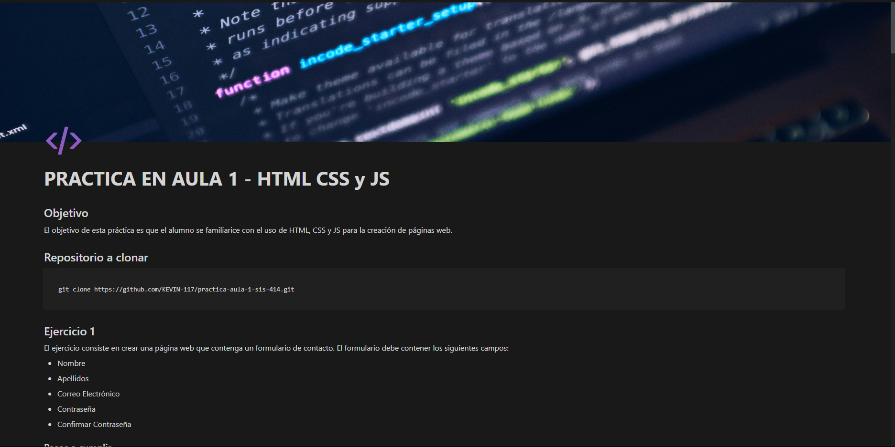

# Practica en Aula 1 - HTML CSS y JS

---

## Objetivo
El objetivo de esta práctica es que el alumno se familiarice con el uso de HTML, CSS y JS para la creación de páginas web.

---

## Evaluacion:

- 30% - Primera Parte:
- 40% - Segunda Parte:
- 30% - Resolucion de ejercicios:

---

## Primera Parte

[click para ver](https://polar-dichondra-742.notion.site/PRACTICA-EN-AULA-1-HTML-CSS-y-JS-1f88e53fe2564ec584ba586601bf18a1)

---

## Segunda Parte

Si a completado la primera parte de la practica, ahora debe de realizar la segunda parte de la practica.

- Tareas a realizar:
  - Tarea 1:
    - Crear un vector vacio de usuarios.
    - Cada ves que se envien datos del formulario se debe de agregar un nuevo usuario al vector.
    - Mostrar los usuarios en la pagina web.
    - De ser necesario debe utiliar funciones para realizar las tareas, de esta manera su codigo sera mas limpio y entendible.
    - (opcional) Puede agregar estilos a su diseño.

---
- Tarea 2:
  - Debe crear un repositorio en GitHub con el nombre de "Practica en Aula 1 - HTML CSS y JS" y subir su codigo.
  - En su repositorio debe de realizar las siguientes acciones:
    - crear al menos 3 ramas con diferentes nombres.
  - Debe de enviar el link de su repositorio en GitHub al aula virtual de classroom.

---

## Resolucion de ejercicios

- Para la resolucion de los ejercicios debe dirigirse a la carpeta "Ejercicios" dentro de hay encontrara directorios con los nombres de los ejercicios, y dentro de cada directorio encontrara 2 archivos:
  - index.html
  - main.js
- Debe de completar la funcion que se encuentra en el archivo main.js para que el programa funcione correctamente.

---

- Debe de resolver los siguientes ejercicios:
  - **_Ejercicio 1:_**
    Desarrolla un programa que imprima los números del 1 al un numero limite dado. Sin embargo, para los múltiplos de 3, imprime "Fizz" al lado del número, para los múltiplos de 5, imprime "Buzz" al lado del número y para los números que son múltiplos tanto de 3 como de 5, imprime "FizzBuzz" al lado del número.

    Por ejemplo, la salida esperada sería:

    ```
    Fizz 3
    Buzz 5
    Fizz 6
    Fizz 9
    Buzz 10
    Fizz 12
    FizzBuzz 15
    ```
  - **_Ejericio 2:_**
    Desarrolla un programa que sume todos los numeros pares de un rango de numeros.
    Por ejemplo, la salida esperada sería:

    ```
    # Ejemplo 1:
    numeroInicial = 1
    numeroFinal = 10
    Salida: 30
    Explicacion: 2 + 4 + 6 + 8 + 10 = 30
    
    # Ejemplo 2:
    numeroInicial = 1
    numeroFinal = 20
    Salida: 110
    Explicacion: 2 + 4 + 6 + 8 + 10 + 12 + 14 + 16 + 18 + 20 = 110
    ```
    


